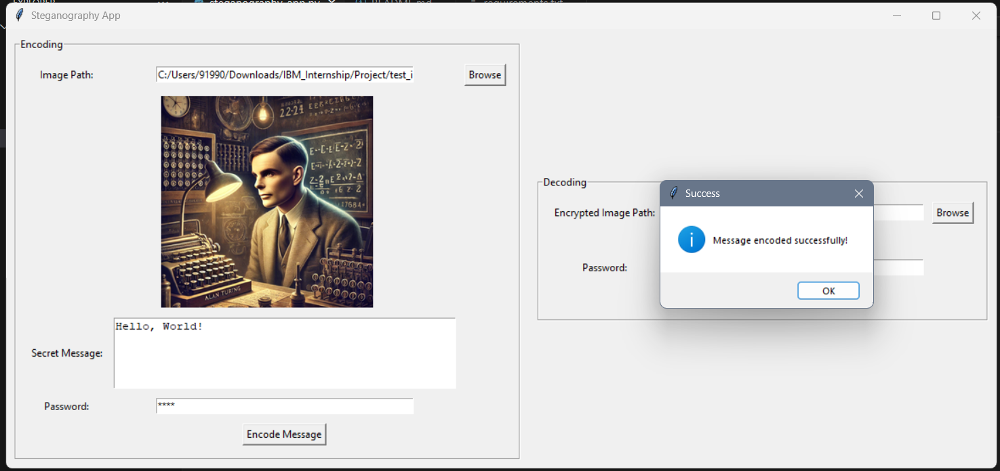
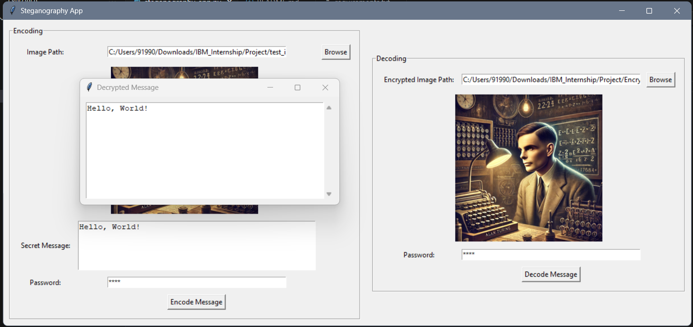
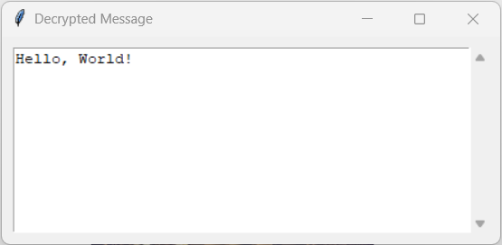

# Steganography App

## Description
This project is a simple steganography application that allows users to hide and retrieve messages within images using a password-protected encoding method. The application is built using Python and Tkinter for the GUI, along with OpenCV and PIL for image processing.

## Features
- Encode secret messages into images.
- Decode hidden messages from encrypted images.
- Password protection for encoding and decoding.
- User-friendly GUI with image preview.

## Technologies Used
- Python
- OpenCV
- Tkinter
- PIL (Pillow)
- Struct

## File Structure
```
📂 IBM-Cybersecurity-Internship
│-- 📂 Encrypted_Images
│   └── (Contains images with hidden messages)
│-- 📂 results
│   ├── Result_Decode.png
│   ├── Result_Decoded_Output.png
│   └── Result_Encode.png
├── README.md (Project documentation)
├── requirments.txt (Project documentation)
├── test_image.webp (Test image)
├── steganography.py (Main application script)
└── steganography_project.pptx (Project presentation)
```

## Installation
1. Clone the repository:
   ```sh
   git clone https://github.com/Akshay-S-Gupta/IBM-Cybersecurity-Internship.git
   ```
2. Navigate to the project directory:
   ```sh
   cd IBM-Cybersecurity-Internship
   ```
3. Install dependencies:
   ```sh
   pip install -r requirements.txt
   ```

## Usage
1. Run the application:
   ```sh
   python steganography_app.py
   ```
2. Select an image to encode a message.
3. Enter your secret message and password.
4. Click "Encode Message" to embed the message into the image.
5. To decode, select an encrypted image, enter the password, and click "Decode Message."

## Results
Here are some sample results from the `results` folder:

### Example of Encoding


### Example of Decoding




## Author
Developed by [Akshay-S-Gupta](https://github.com/Akshay-S-Gupta)